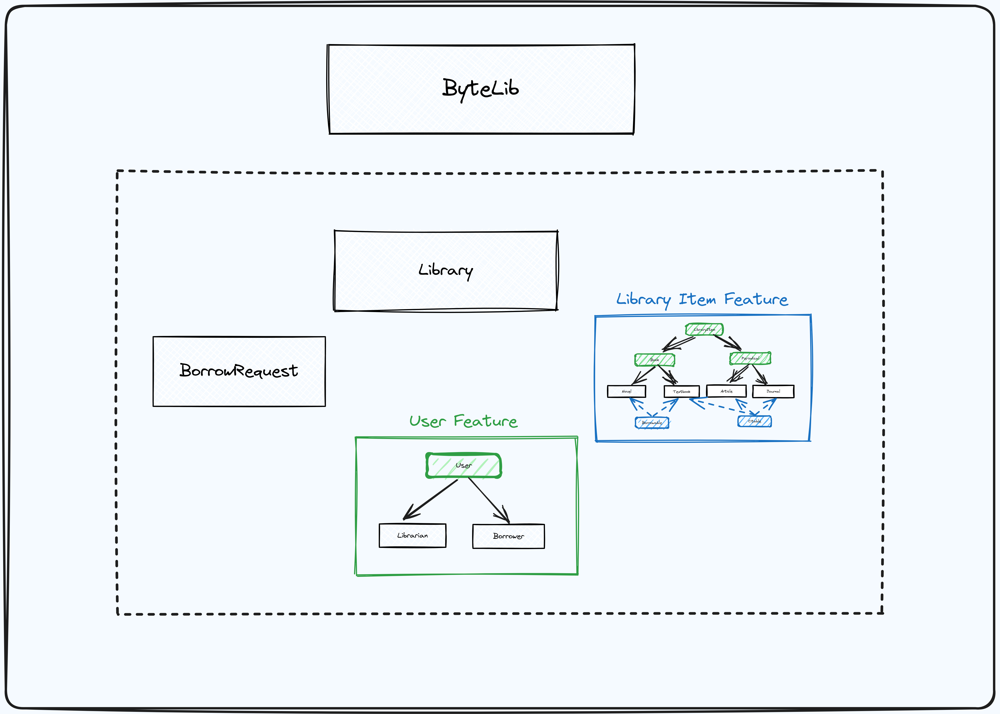
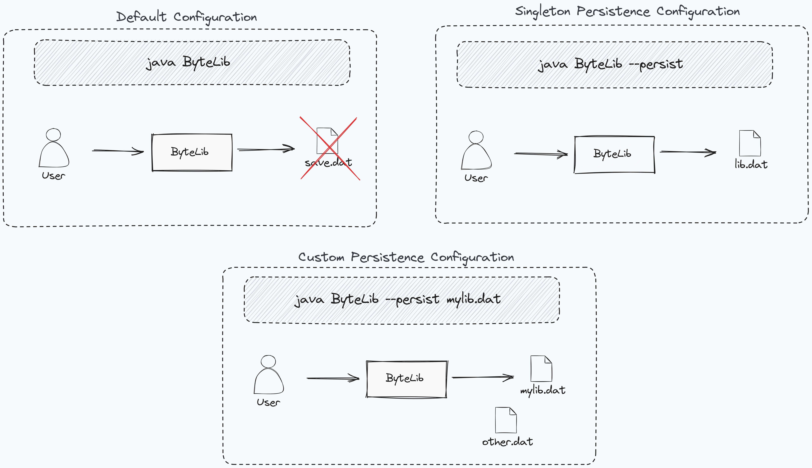

# ByteLib - Professional CLI Library Management System

**ByteLib** is a sophisticated Java project that encompasses a command-line interface (CLI) library management system. It presents a comprehensive suite of features designed to meet the needs of both librarians and borrowers, offering efficient tools for managing library resources, procedures, and user interactions.




## Features

### 1. Multi-User Model

The application features proper authentication and authorization prodcedures, allowing for management of multiple accounts of multiple type. This way, librarians gain efficient tools for resource management, while borrowers enjoy a user-friendly interface for browsing, borrowing, and contributing to scholarly endeavors.

### 2. Librarian Features

- **View and Interact With Desired Catalogues:**
    - Explore detailed information about the books and scientific items catalogues.

- **Manage Item Inventory:**
    - Librarians can seamlessly add new books or scientific items to the library and remove existing items.

- **View and Manage Borrow Requests and Keep Track of Borrowed Items:**
    - Monitor and manage borrow requests, keeping track of the requests made, the users that make the requests, books and their status, request date, and borrower information.

### 3. Borrower Features

- **Browse Desired Catalogues:**
    - Borrowers can effortlessly browse through the available books and scientific items catalogues.

- **Borrow and Return Items:**
    - Borrowers can initiate borrowing, return borrowed items, and access their comprehensive borrow history.

- **Cite Scientific Items:**
    - Borrowers can contribute to the scholarly landscape by citing scientific items, with the system diligently tracking the number of citations.

- **Account Management:**
    - Borrowers have the flexibility to create accounts, log in securely, and log out when needed. Robust password and account validation mechanisms ensure utmost security.

## Persistence Model

**ByteLib** supports 3 persistence models for storage of library data, allowing the system to save and load library information from a specified file. The default file path is "lms.dat," and users can provide a different file path as a command-line argument.



## Installation

1. **Clone Repository:**
    - Clone the ByteLib repository from [GitHub](https://github.com/davidandw190/p3-bytelib).

2. **Compile Source Code:**
    - Compile the source code using the following command:
      ```bash
      javac ByteLib.java
      ```

3. **Run Application:**
    - Run the application with the following command:
      ```bash
      java ByteLib
      ```

## Usage

1. **Librarian Login:**
    - Upon initiating ByteLib, librarians can log in using the default credentials:
        - Username: admin
        - Password: 123

2. **Authentication Model:**
    - Borrowers can seamlessly create accounts and log in securely into the application. A user created upon initialization is:
      - Username: user
      - Password: 123

3. **Interactive Menus:**
    - ByteLib provides intuitive and interactive menus for librarians and borrowers, guiding users through an array of available options.

4. **Catalog Browsing:**
    - Users can effortlessly navigate the library catalog, exploring available books and scientific items with ease.

5. **Borrow and Return:**
    - Borrowers can seamlessly borrow and return items, while librarians efficiently manage these transactions.

6. **Citation:**
    - Borrowers actively contribute to the scholarly community by citing scientific items, actively contributing to the overall citation count.

7. **Persistence Options:**
    - Users can enable persistence by providing the "--persist" or "-p" command-line option, or run the application without persistence config, allowing the system to seamlessly save and load data.

## Dependencies

- [Apache Commons Lang](https://commons.apache.org/proper/commons-lang/): Incorporated for efficient string manipulation.
---